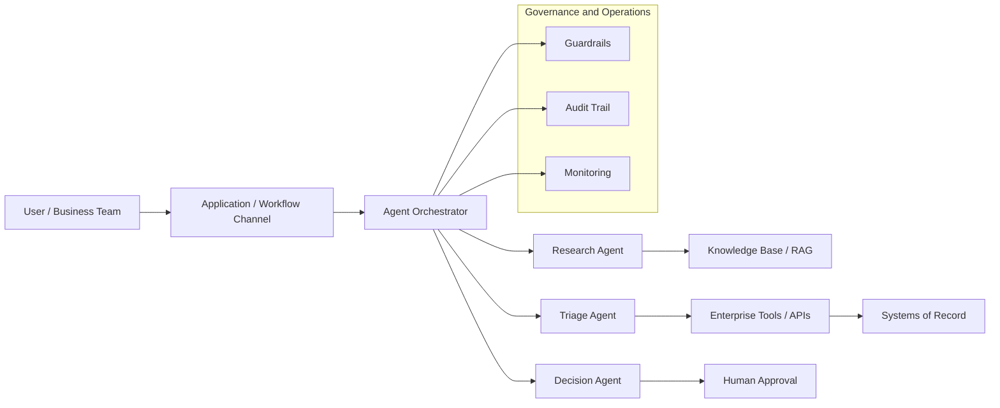

# Architecture Diagram Designer

A Claude skill for creating, improving, and expanding architecture diagrams. Produces clean, readable Mermaid diagrams at the right level of abstraction — L1, L2, L3, agentic workflow, data flow, or sequence. Can also generate visual design briefs for PowerPoint or image generation.

---

## What It Does

- Creates Mermaid diagrams at L1, L2, or L3 depth based on available detail
- Normalizes architecture layout: users/channels left → orchestration center → tools/data right
- Applies platform-neutral labels by default; uses native service names when a platform is specified
- Validates readability before output (clarity, boundaries, governance visibility)
- Produces visual design briefs for the **pptx** or **hcltech-slide-artist-openai** skills when presentation-quality graphics are needed
- Can be orchestrated by **agentic-arch-documenter** or **hcltech-rom-package-builder**

---

## When to Use

Trigger phrases: "create a diagram", "draw the architecture", "Mermaid diagram", "L1 diagram", "L2 diagram", "agentic workflow diagram", "data flow diagram", "deployment diagram", "cloud diagram", "diagram for the deck."

> For full architecture documents with analysis, requirements, and decisions, use **agentic-arch-documenter** instead.

---

## Diagram Types

| Type | Use When |
|------|----------|
| L1 Logical Architecture | Actors, channels, orchestration, agents/services, tools/data, governance |
| L2 Logical Detail | Agent roles, context retrieval, tool/API boundaries, data stores, observability |
| L3 Deployment | Cloud services, runtime boundaries, network zones, IAM/RBAC, model infrastructure |
| Agentic Workflow | Intake → planning → tool use → retrieval → decision → approval → action → audit |
| Data Flow | Producers, stores, processing, consumers, controls |
| Sequence | Order and interaction timing between components |

---

## Example Output



---

## Structure

```
architecture-diagram-designer/
├── SKILL.md          # Claude skill instructions
├── README.md         # This file
└── references/
    ├── mermaid-patterns.md
    ├── diagram-quality-checklist.md
    ├── platform-diagram-guidance.md
    └── sample-prompts.md
```

---

## Example Prompts

```
Draw an L1 architecture diagram for an agentic customer support solution.

Create an L2 diagram showing how the RAG pipeline connects to the orchestrator.

Generate an agentic workflow diagram for invoice processing automation.

Create a deployment diagram for this solution on Azure.
```

---

## Platform Behavior

- **No platform specified** → logical names (e.g., "Vector Store", "Orchestrator", "API Gateway")
- **Platform specified** → native service names (e.g., Azure AI Search, AWS Lambda, GCP Vertex AI)
- **Multiple providers** → logical architecture first, provider mapping separate
