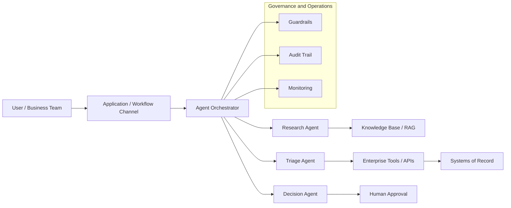

# Architecture Diagram Designer

## Operating Principles

Default to Mermaid because it is editable, reviewable, and works well in Markdown architecture
artifacts. Use platform-neutral labels unless the user or source material specifies a target
cloud, SaaS, on-prem, or hybrid platform.

Prefer clarity over decoration. A good architecture diagram explains boundaries,
responsibilities, flows, integrations, security/governance layers, and operational concerns
without requiring a long verbal explanation.

Generate the most detailed diagram set the available information supports, but separate views
by architecture level rather than forcing all detail into one graphic:

- **L1 Logical Architecture:** major actors, channels, orchestration, agent/service roles,
  context sources, tools/APIs, systems of record, approval, governance, audit, and monitoring.
- **L2 Detailed Logical Components:** component responsibilities, agent collaboration,
  retrieval/knowledge flow, tool access layer, integration boundaries, data stores, decision
  points, and operational control points.
- **L3 Deployment / Implementation:** cloud services, network zones, runtime topology,
  IAM/RBAC, queues, databases, APIs, vector stores, model endpoints, CI/CD, and runbooks —
  only when platform and implementation details are known or explicitly assumed.

---

## Workflow

### 1. Choose the View

Select the appropriate view type based on the request:

| View | Use When |
|------|----------|
| L1 Logical Architecture | Actors, channels, orchestration, agents/services, tools/data, governance, operations |
| L2 Logical Detail | Agent roles, context retrieval, tool/API boundaries, data stores, approval workflows, observability |
| L3 Deployment | Cloud/on-prem services, runtime boundaries, network zones, IAM/RBAC, model/vector infrastructure, CI/CD |
| Agentic Workflow | Intake → planning → tool use → retrieval → decision → human approval → action → audit |
| Data Flow | Producers, stores, processing, consumers, controls |
| Sequence | Use only when order and interaction timing matter |

### 2. Normalize the Architecture

- Put **users/channels** on the left.
- Put **orchestration and agent/service logic** in the center. Show the design pattern
  (single orchestrator, ReAct-style agent, supervisor/worker team, planner/executor,
  workflow-first automation, or specialized agent team) when it matters.
- Put **tools, APIs, data stores, knowledge bases, and systems of record** on the right.
- Show agent-to-agent protocols as logical relationships only, not protocol message formats.
- Put **governance, security, observability, and human approval** as cross-cutting or
  adjacent layers.

### 3. Respect Platform Constraints

- No platform specified → use logical names (see `references/platform-diagram-guidance.md`).
- Platform specified → use that platform's native service names where sensible.
- Mandated services → include explicitly and do not replace them.
- Multiple providers → separate logical architecture from provider mapping.

### 4. Produce the Diagram

- Use concise node labels.
- Use subgraphs for real boundaries: `Customer Channels`, `Agentic Orchestration`,
  `Enterprise Systems`, `Knowledge and Data`, `Governance`.
- Avoid overloaded nodes and edge labels longer than a few words.
- Avoid protocol-level detail in L1 diagrams: no MCP server config, tool schemas, prompt
  chains, vector chunking strategy, model routing rules, or A2A message formats unless the
  user asks for a lower-level view.
- When more detail is available, produce multiple diagrams rather than one crowded one.
  Label each clearly: L1, L2, L3, workflow, data flow, or sequence.
- Include a short legend only when symbols or colors carry meaning.

Read `references/mermaid-patterns.md` for reusable starting patterns.

### 5. Validate Readability

Read `references/diagram-quality-checklist.md` before finalizing. Key checks:

- Clear start, central control point, integration boundary, and outcome.
- Every major component has a visible purpose.
- Security, audit, monitoring, and human approval are visible when relevant.

---

## Output Rules

Return Mermaid by default:

When the user needs presentation-quality graphics, first create the Mermaid logical diagram
and a short visual design brief. Then pass the brief to the **hcltech-slide-artist-openai**
skill if image generation is needed, or to the **pptx** skill for an editable deck visual.

---

## Reference Files

| File | When to read |
|------|-------------|
| `references/mermaid-patterns.md` | For reusable diagram patterns as starting points |
| `references/diagram-quality-checklist.md` | Before finalizing any diagram |
| `references/platform-diagram-guidance.md` | When a hyperscaler, SaaS, on-prem, or hybrid platform is specified |
| `references/sample-prompts.md` | When the user asks how to invoke or reuse this skill |
