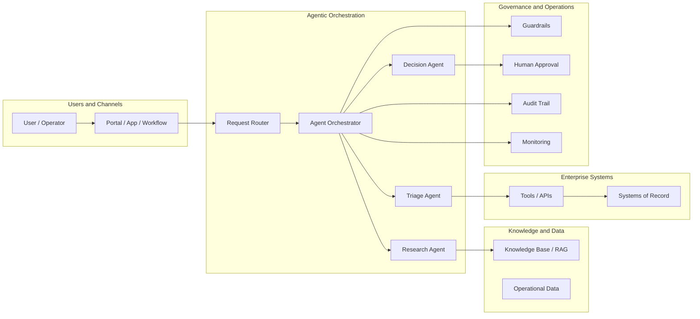
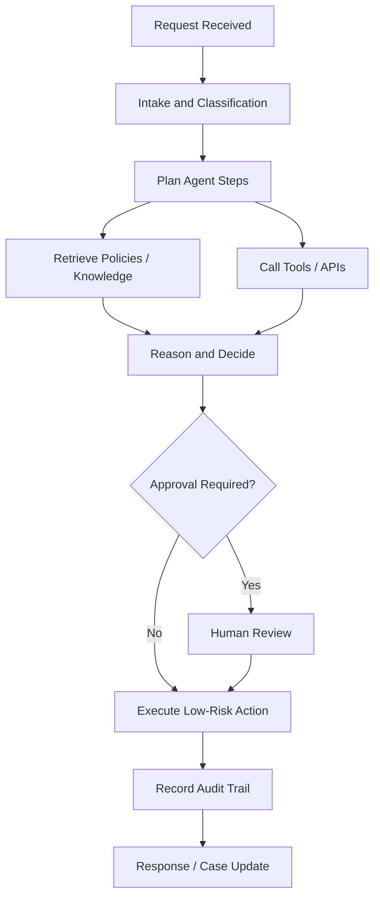
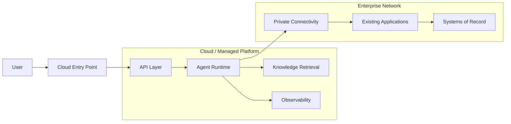

# Mermaid Patterns

## Level 1 Agentic Architecture

```mermaid
flowchart LR
  subgraph Users["Users and Channels"]
    User["User / Operator"]
    Channel["Portal / App / Workflow"]
  end

  subgraph Orchestration["Agentic Orchestration"]
    Router["Request Router"]
    Orchestrator["Agent Orchestrator"]
    Triage["Triage Agent"]
    Research["Research Agent"]
    Decision["Decision Agent"]
  end

  subgraph Knowledge["Knowledge and Data"]
    KB["Knowledge Base / RAG"]
    Data["Operational Data"]
  end

  subgraph Enterprise["Enterprise Systems"]
    APIs["Tools / APIs"]
    SOR["Systems of Record"]
  end

  subgraph Controls["Governance and Operations"]
    Guardrails["Guardrails"]
    Approval["Human Approval"]
    Audit["Audit Trail"]
    Monitor["Monitoring"]
  end

  User --> Channel --> Router --> Orchestrator
  Orchestrator --> Triage
  Orchestrator --> Research
  Orchestrator --> Decision
  Research --> KB
  Triage --> APIs
  APIs --> SOR
  Decision --> Approval
  Orchestrator --> Guardrails
  Orchestrator --> Audit
  Orchestrator --> Monitor
```

## Agent Workflow

```mermaid
flowchart TD
  Start["Request Received"] --> Intake["Intake and Classification"]
  Intake --> Plan["Plan Agent Steps"]
  Plan --> Retrieve["Retrieve Policies / Knowledge"]
  Plan --> Tools["Call Tools / APIs"]
  Retrieve --> Decide["Reason and Decide"]
  Tools --> Decide
  Decide --> Gate{"Approval Required?"}
  Gate -->|No| Act["Execute Low-Risk Action"]
  Gate -->|Yes| Human["Human Review"]
  Human --> Act
  Act --> Audit["Record Audit Trail"]
  Audit --> End["Response / Case Update"]
```

## Hybrid Deployment

```mermaid
flowchart LR
  User["User"] --> CloudEntry["Cloud Entry Point"]

  subgraph Cloud["Cloud / Managed Platform"]
    API["API Layer"]
    Runtime["Agent Runtime"]
    KB["Knowledge Retrieval"]
    Obs["Observability"]
  end

  subgraph Enterprise["Enterprise Network"]
    Gateway["Private Connectivity"]
    Apps["Existing Applications"]
    Data["Systems of Record"]
  end

  CloudEntry --> API --> Runtime
  Runtime --> KB
  Runtime --> Gateway
  Gateway --> Apps
  Apps --> Data
  Runtime --> Obs
```
